# A Deep Learning Approach For 3D Printing Monitoring
## Over-view
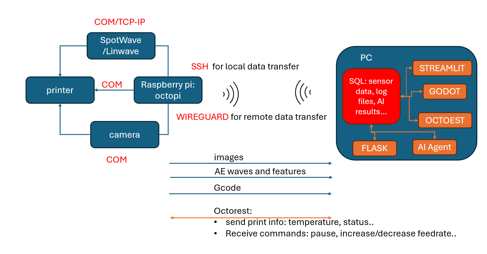
As additive manufacturing evolves, the integration of cyber-physical systems, AI-driven monitoring, and digital twins enhances process optimization, defect detection, and remote control. This work presents a secure and intelligent cyber infrastructure for real-time 3D printing monitoring and control, leveraging a network of hardware, software, databases, and secure communication protocols to ensure seamless operation.
The hardware architecture consists of a 3D printer, high-resolution cameras, and acoustic emission (AE) sensors that capture real-time process data. A Raspberry Pi functions as an edge processing unit, handling data acquisition and local computations, while a client PC deals with heavy computing and provides a user-friendly interface for monitoring and control. This distributed hardware setup enables real-time defect detection, predictive maintenance, and autonomous print optimization.
The software stack integrates multiple layers of functionality. Godot is employed to develop a real-time digital twin, offering a dynamic virtual representation of the 3D printing process. This allows users to visualize print progress, analyze deviations, and simulate different scenarios for process optimization. OctoPrint serves as the core print management server, facilitating job execution, logging, and control. AI-driven analytics, powered by a Flask app, process sensor data to detect anomalies such as layer defects, overheating, and structural inconsistencies. Streamlit app provides an interactive dashboard for remote users, enabling real-time monitoring, control, and AI-driven insights. Additionally, REST API (OctoRest) allows seamless integration with OctoPrint, enabling external applications to interact with the printing process programmatically.
Central to this infrastructure is the SQL-based database, which plays a critical role in enabling automation, data-driven decision-making, and real-time process optimization. The database ensures structured storage of sensor readings, system performance metrics, and AI analysis results, enabling the system to track historical performance, detect patterns, and improve future print jobs through continuous learning. By using SQL queries, the system can automatically retrieve and analyze historical data to predict maintenance needs, adjust print parameters in real time, and ensure high-quality prints with minimal manual intervention.
To securely connect all components, the system implements a suite of communication protocols that facilitate data transfer and remote management. SSH/SFTP ensures encrypted file transfers between the client, Raspberry Pi, and server, protecting sensitive print data. WireGuard VPN, leveraging UDP, provides secure remote access, enabling authorized users to monitor and control the system from external networks. TCP/IP and COM protocols establish low-latency communication between the Raspberry Pi, sensors, and the 3D printer. 
This cyber infrastructure creates a robust, secure, and intelligent environment for additive manufacturing, enabling real-time AI-driven defect detection, automated process control, and digital twin-based visualization. By leveraging secure data transfer mechanisms, AI-driven analytics, and an optimized SQL architecture, the system enhances manufacturing efficiency, reduces material waste, and ensures high-quality prints. The fusion of digital twins with real-world sensor data bridges the gap between physical and virtual manufacturing, paving the way for next-generation smart factories and autonomous additive manufacturing systems.

## Introduction
3D printing represents a significant leap forward in additive manufacturing technology. Despite its promising capabilities, the printing process often encounters various challenges, leading to frequent failures. These issues, such as under extrusion, stringing, and spaghettification, are diverse and recurrent, significantly impeding the seamless execution of print jobs. Consequently, these common errors pose substantial hurdles to the reliability and efficiency of 3D printing technology. These deficiencies can be rectified by having a closed-loop monitoring system, that can see defects and adjust printing properties to remove this defect from the rest of the print
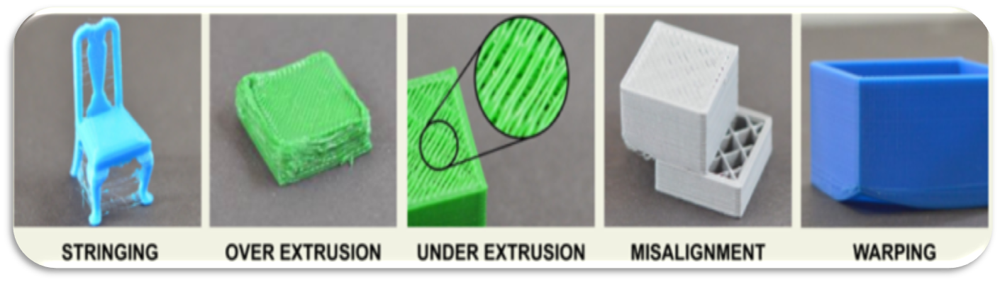
This project introduces an innovative method to improve quality control in 3D printing by integrating real-time image analysis and acoustic emission sensing, enhanced through machine learning techniques:
Detecting and classifying defects in 3D-printed parts by analyzing images captured during the printing process in real time.
Identifying defect occurrence during printing using an acoustic sensor attached to the nozzle, providing real-time feedback on potential issues.
The geometry used to test these errors was a set of two cylindrical pillars with a rectangular tower in the middle.
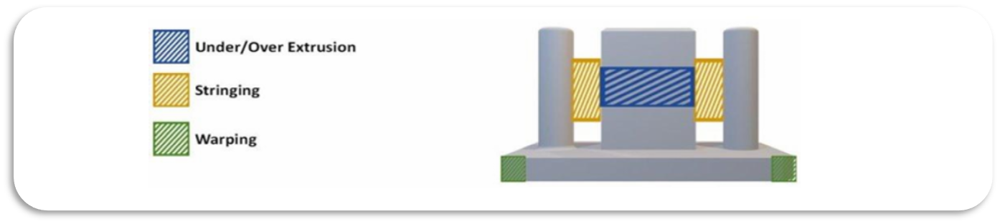
The object was sliced in Cura using default settings, representing a standard configuration for many 3D printers. 
To simulate under-extrusion, the g-code was modified to reduce the extrusion rate. 
Stringing errors were induced by increasing the printing temperature and disabling retraction in Cura. 
Spaghettification errors were generated by instructing the printer to create layers in midair, causing the extruded plastic to lack support and form long curls across the print bed. 
Our proposed monitoring system is capable of detecting these three types of print defects and adjusting printing parameters to correct them by:
Modifying nozzle temperature
Adjusting flow rate
Pausing the print
## Methods
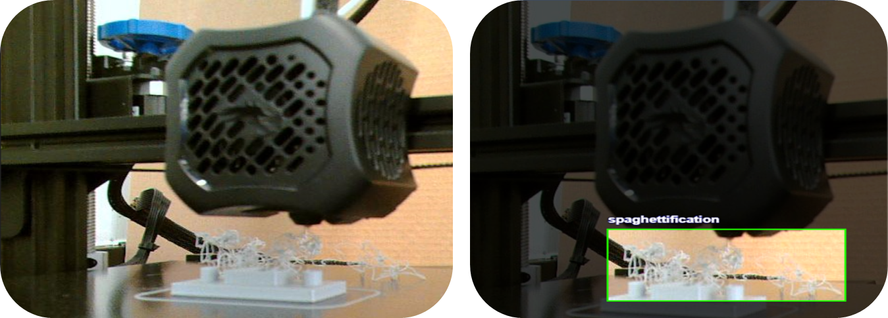
Images are captured during the printing process to detect purposely created defects by altering the G code, then the collected data is used to train an object detection model YOLOv5s, enabling real-time identification of defects. Upon detection, commands are sent through OctoPrint installed on a RaspberryPi to adjust printer settings dynamically, ensuring optimal print quality.
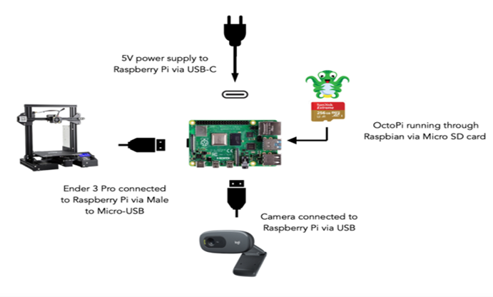
Furthermore, acoustic emission signals generated during the printing process are captured and analyzed to identify patterns associated with various defects. Feature extraction techniques are applied to the acoustic data, and a dense neural network is trained to classify those defects.
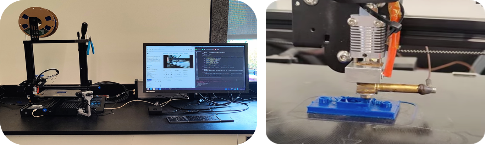
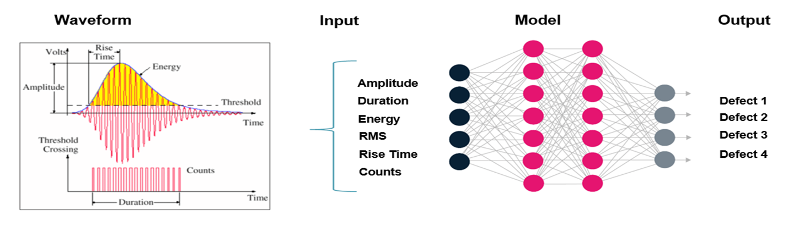
## Results
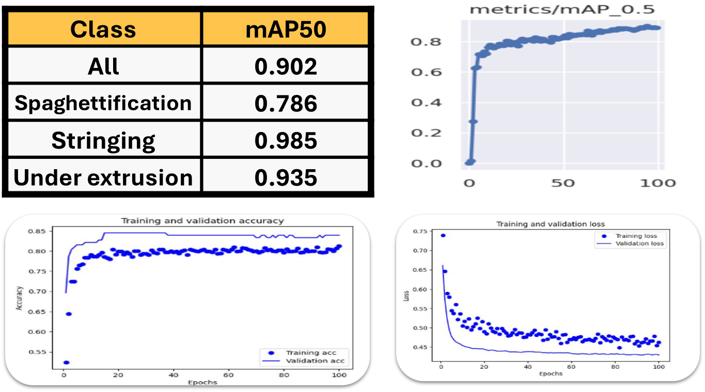
By integrating the two modalities and using both computer vision and time series, this approach demonstrate excellent performance, enabling automated adjustments to optimize print quality and minimize production errors. 
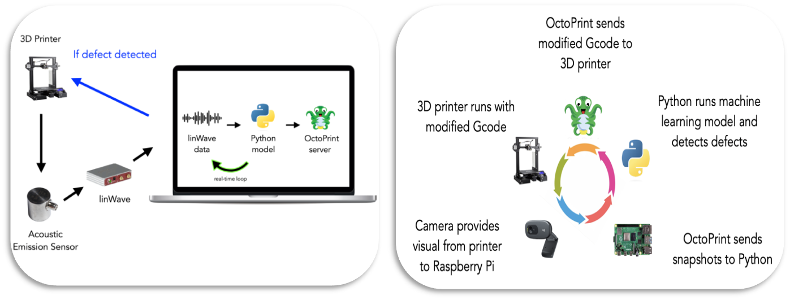
This classification models was also deployed in real time which makes both approaches not only serve to identify defects but also contributes to the closed-loop control of the printer in real-time application.

By reducing the number of failed prints, we minimize the waste generated by additive manufacturing, making the process both environmentally friendly and economically beneficial. Since additive manufacturing already produces less waste compared to subtractive methods, this further enhances its sustainability. Additionally, our approach helps increase confidence in the reliability of additive manufacturing.

# Digital-Twin
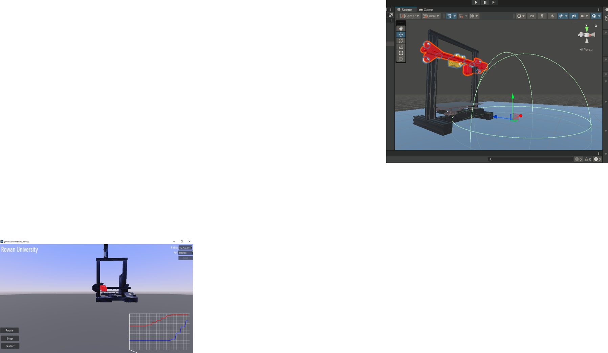
Godot is a powerful open-source game engine that can be effectively used for building digital twins used for simulation, monitoring, and optimization
WebSockets, HTTP, MQTT for real-time data from IoT devices
Virtual Reality (VR) & Augmented Reality (AR) support
Machine Learning Integration
 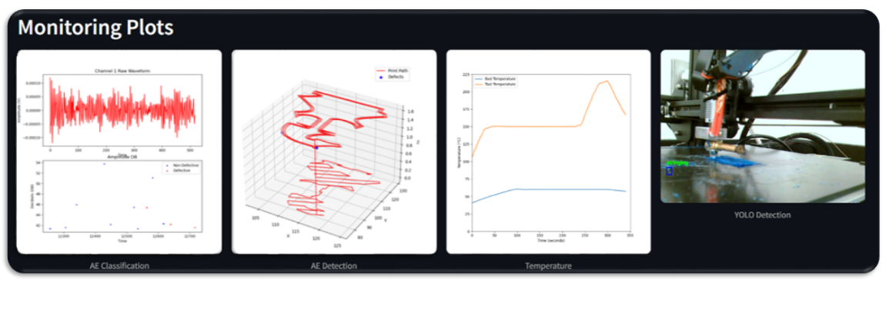
 Web-Based Data Visualization: Embeds visualizations in web pages using Jinja2 templates
 Backend API for Visualization Tools: Integrates with cloud services
 Real-Time Data Streaming: IoT & API data integration
 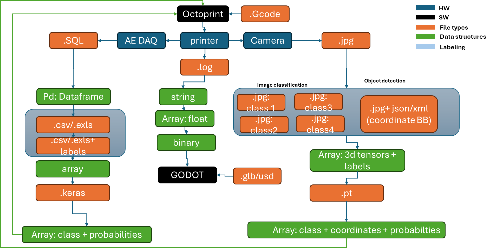
 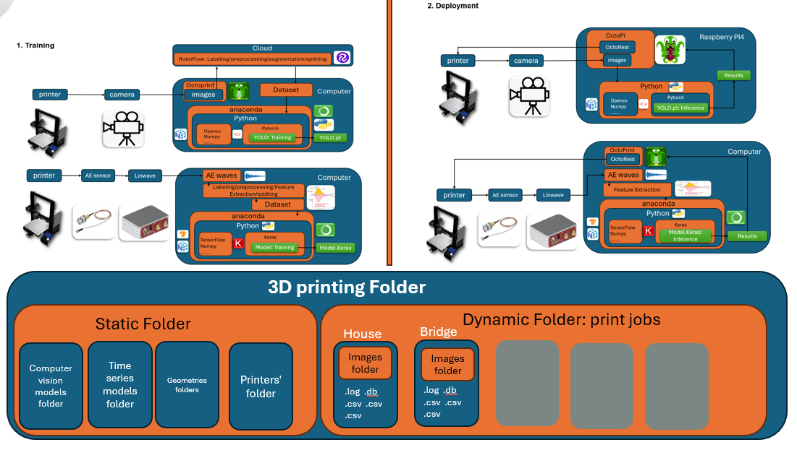
 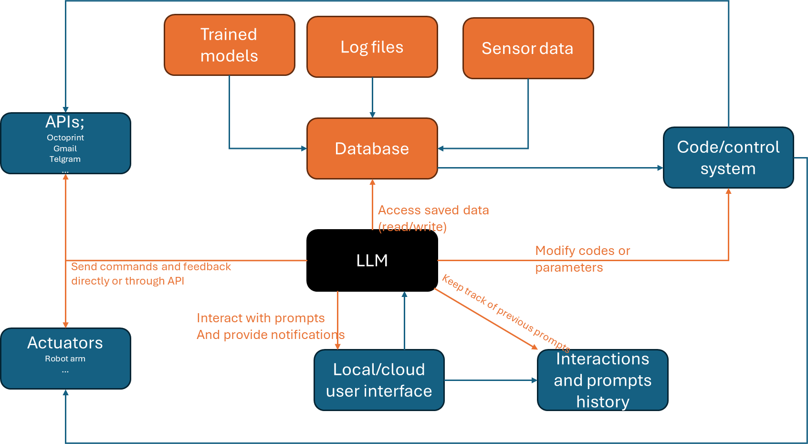
 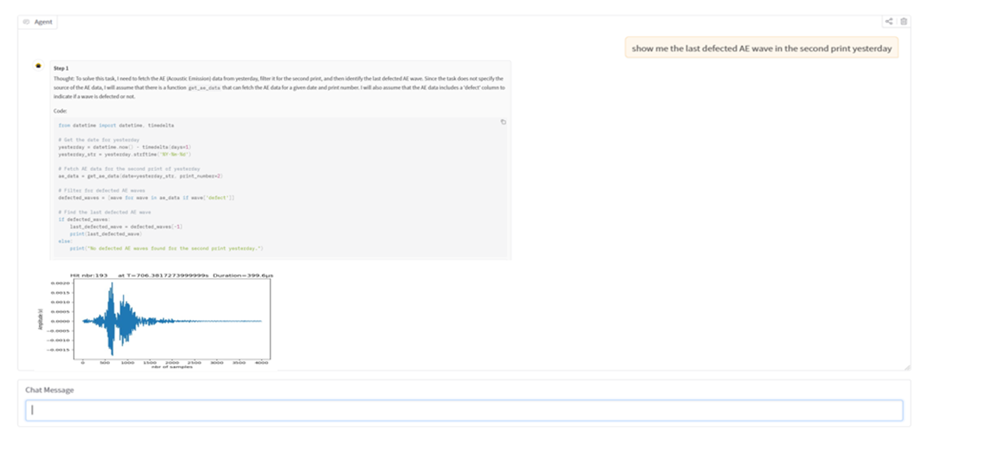
 
 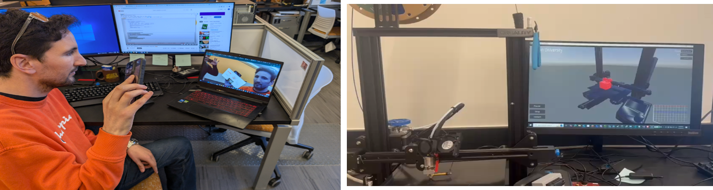
creat a flask app that display the sensors, the geometry and the ML models results in realtime. (we can control and state …)
Deploy it  (locally for now: local website)
Run a python code that saves a screenshot of that website periodically
Using XAMPP creat an apache secure web server and run a HTML file on that server that calls the AR.js libraray and display the frames of the website on a board when the camera detcts a specific image/pattern

# How to use it
install vs-code : https://code.visualstudio.com/

install python : https://www.python.org/downloads/   make sure to select "add to path"
install git : https://git-scm.com/downloads/win

creat a folder and open it in vscode, then open a bash terminal and run : git clone https://github.com/bensidhom/Novel-Cyber-Infrastructure-Enabling-AI-Driven-Analytics-and-Digital-Twins-for-Real-Time-3D-Printing.git

then run  : cd Novel-Cyber-Infrastructure-Enabling-AI-Driven-Analytics-and-Digital-Twins-for-Real-Time-3D-Printing/
creat a virtual envirement: python -m venv venv 

activate: venv\Scripts\activate.bat 

pip install -r requirements.txt

press ctr+Shift+p then 'enter interpreter path" and insert the python.exe in the venv folder

in cmd run: streamlit run inferece_deployement\stream1

if the python scripts keep running in the background :
run : taskkill /F /IM python.exe /T   (power shell)

run :  taskkill /F /IM pythonw.exe /T       to kill python process

install GODOT_v4.3 : https://godotengine.org/download/archive/4.3-stable/   download .net version to use the C# sripts

instal the .net sdk from: https://dotnet.microsoft.com/en-us/download/dotnet/thank-you/sdk-9.0.304-windows-x64-installer

follow the tutorial to add openXR to godot and use the MetaQuest : https://docs.godotengine.org/en/stable/tutorials/xr/setting_up_xr.html
 (install Android studio and open JDK 17)

